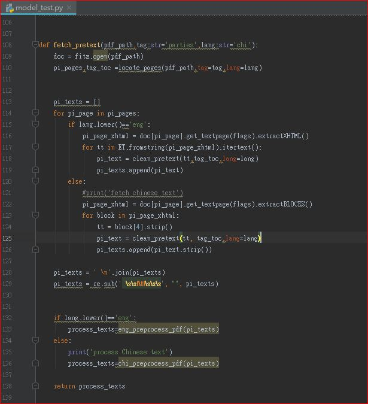

# Introduction of IPO sponsor lines gluer module

This module is one of the key components of the IPO sponsors and underwriter parser project: https://github.com/etnetapp-dev/ipo_pdfparsing_server .

In IPO sponsors and underwriter parser project, there are two machine learning models, icluding Name Entity Recognition and pdf line gluer.

The pdf line gluer model aims to clean the raw text/paragraph content extracted from pdf documents with paragraph termination symbols, used as line endings and hard-hyphenations.

The model is fork from a PDF cleaner repository: this repository: https://github.com/serge-sotnyk/pdf-lines-gluer.  Please refer to the pdf_gluer.ipynb in the original repository as the training and deployments steps are somehow the same as original workflow.

### Model components

# use of this module
In the training process, we divide the training script and dataset into English and Chinese versions as both languages requires two different raw data and hyper-parameters for training.

For deployment, please use functionality by calling function preprocess_pdf() from the pdf_preprocessor.py.

The design of model is not language dependent and it applies logistic classifier to differentiate whether the line is glued or independent from previous line.

# Creation of corpus for training
1. Extract the raw texts/paragraphs from the "parties involved" and "underwriting" portion of IPO prospectus pdf documents. (/data/raw/eng, and /data/raw/chi)
2. label the data at the end of each line in the excel file ('*' - leave as is, '+' - should be glued). (/data/label_data.xlsx)
3. Export labeled data to txt. files and get ready to load the data for model training (/data/process/eng/  and /data/process/chi)

### label of raw textual data

# Model training
There are three scripts for training the pdf line gluer models,including
- pdf_gluer.py : specify the hyper-parameters and define type of classifiers for line gluer model
- pdf_lines_gluer.py : define the model template and skelekon 
- pdf_preprocessor.py : stores the model structures and contains the function to  be called in deployment

### key training parameters and file paths

1. define the dataset file path and the full paths of two other scripts (pdf_lines_gluer.py and pdf_preprocessor.py )
2. set up the three key hyper-paraemters, including max_iter, seed and test size

For Chinese dataset, please specify a higher max_iter in order to achieve better accuracy.

Note: don't delete the "# inject code here #" in the pdf_lines_gluer.py. 

### Model template

# Model deployment
In the script, model_test.py, there are four major steps to apply the preprocess_function:
### input:
- pdf file path
- language (either "eng" and "chi")
- tags (either "parties involved" and "underwriting")

### steps in model_test.py
1. read the pdf file by python open library: pymupdf (import fitz)
2. locate the page numbers of tags (either "parties involved" and "underwriting") from table of content of the pdf file ( with the locate_pages function)
3. clean raw texts extracted from indicated pages (with clean_pretext function)
4. run the pdf line gluer model to align the text lines or paragraphs (with eng_preprocess_pdf or chi_preprocess_pdf function)

### output:
- processed texts or paragraphs after data cleaning and aligning 

### Model deployment script

