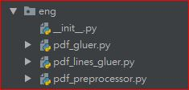
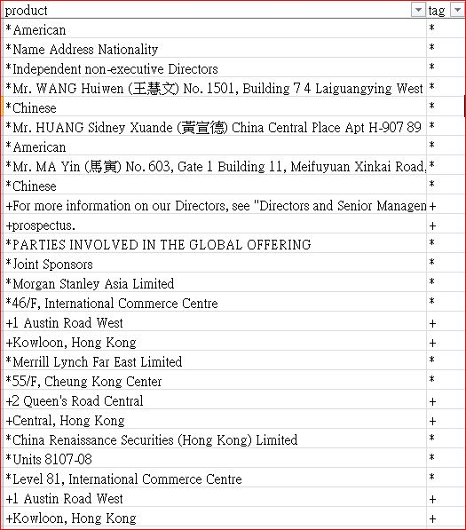
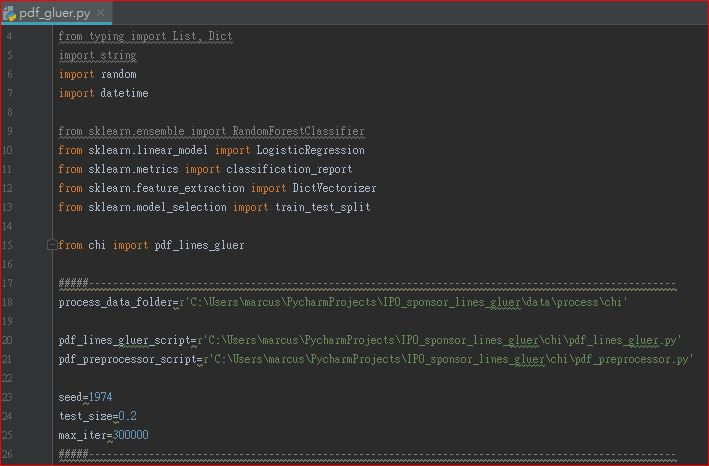
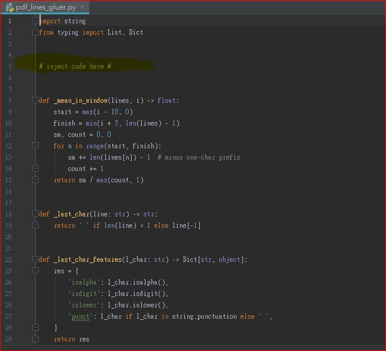

# Introduction of IPO sponsor lines gluer module

This module is one of the key components of the IPO sponsors and underwriter parser project: https://github.com/etnetapp-dev/ipo_pdfparsing_server .

In IPO sponsors and underwriter parser project, there are two machine learning models, icluding Name Entity Recognition and pdf line gluer.

The pdf line gluer model aims to clean the raw text/paragraph content extracted from pdf documents with paragraph termination symbols, used as line endings and hard-hyphenations.

The model is fork from a PDF cleaner repository: this repository: https://github.com/serge-sotnyk/pdf-lines-gluer.  Please refer to the pdf_gluer.ipynb in the original repository as the training and deployments steps are somehow the same as original workflow.

### Model components

# use of this module
In the training process, we divide the training script and dataset into English and Chinese versions as both languages requires two different raw data and hyper-parameters for training.

For deployment, please use functionality by calling function preprocess_pdf() from the pdf_preprocessor.py.

The design of model is not language dependent and it applies logistic classifier to differentiate whether the line is glued or independent from previous line.

# Creation of corpus for training
1. Extract the raw texts/paragraphs from the "parties involved" and "underwriting" portion of IPO prospectus pdf documents. (/data/raw/eng, and /data/raw/chi)
2. label the data at the end of each line in the excel file ('*' - leave as is, '+' - should be glued). (/data/label_data.xlsx)
3. Export labeled data to txt. files and get ready to load the data for model training (/data/process/eng/  and /data/process/chi)

### label of raw textual data

### key training parameters and file paths

### Model template

